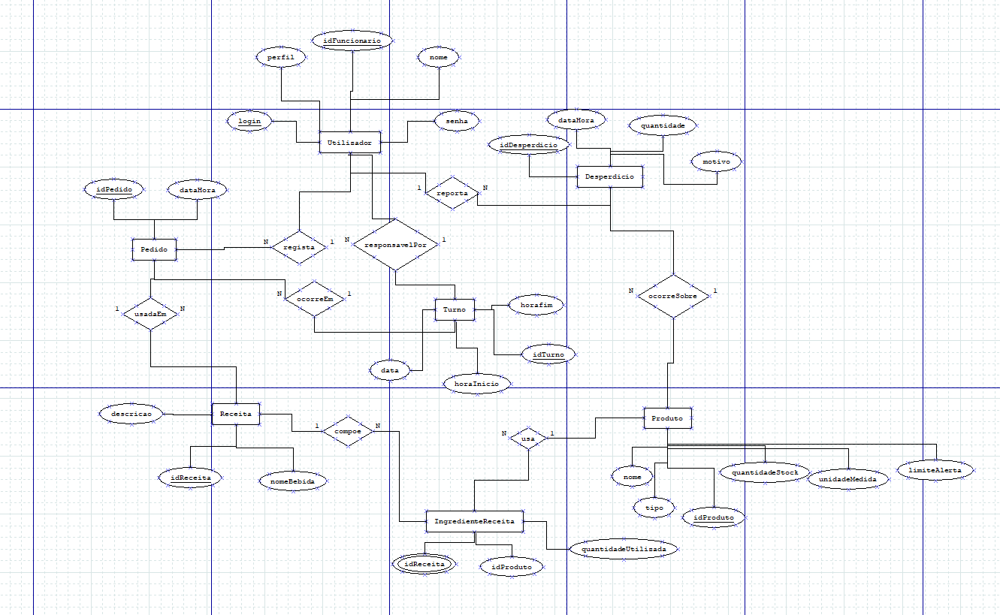

# C2 : Esquema conceptual

## Modelo E/A

## Entidades

- **PRODUTO(idProduto, nome, tipo, quantidadeStock, unidadeMedida, limiteAlerta) 

- **RECEITA(idReceita, nomeBebida, descricao) 

- **UTILIZADOR(idFuncionario, nome, perfil, login, senha) 

- **PEDIDO(idPedido, dataHora) 

- **DESPERDÍCIO(idDesperdicio, dataHora, quantidade, motivo) 

- **TURNO(idTurno, data, horaInicio, horaFim) 

- **INGREDIENTERECEITA(idReceita, idProduto, quantidadeUtilizada) 
 (Entidade associativa que representa a composição de uma receita com múltiplos ingredientes)

## Associações

- **compõe(RECEITA, INGREDIENTERECEITA) → 1:N total/total 

- **usa(INGREDIENTERECEITA, PRODUTO) → N:1 total/total 

- **usadaEm(RECEITA, PEDIDO) → 1:N total/total 

- **regista(PEDIDO, UTILIZADOR) → N:1 total/total 

- **ocorreEm(PEDIDO, TURNO) → N:1 total/total 

- **reporta(UTILIZADOR, DESPERDÍCIO) → 1:N total/total 

- **ocorreSobre(DESPERDÍCIO, PRODUTO) → N:1 total/total 

- **responsávelPor(TURNO, UTILIZADOR) → N:1 total/total 

## Regras de negócio adicionais (Restrições)

- **Cada pedido de bebida consome ingredientes específicos, conforme definido numa receita padrão e previamente registada no sistema. 
 
- **O stock de produtos é atualizado automaticamente após o registo de um pedido, garantindo que os dados refletem a realidade operacional em tempo real. 
 
- **Produtos com quantidade inferior a um determinado limite (exemplo: 10 unidades) devem ser automaticamente marcados como "A terminar", servindo de alerta à gestão para ações preventivas de reposição. 
 
- **Produtos com quantidade igual a zero são considerados "Indisponíveis", não podendo ser utilizados em novos pedidos até reposição. 
 
- **Não é possível registar desperdícios sem indicar o motivo, sendo obrigatória a associação a um produto, uma quantidade e uma causa (ex: erro humano, validade expirada, falha técnica). 
 
- **A quantidade em stock não pode assumir valores negativos, sendo o sistema responsável por validar as operações de consumo e desperdício antes da atualização do inventário. 
 
- **As alterações manuais aos registos de stock são reservadas a utilizadores com perfil de gestor, garantindo a segurança. 
 
- **O sistema deve garantir que os registos de consumo e desperdício atualizam o stock em tempo real, sem permitir inconsistências ou valores inválidos. 
 
- **Cada desperdício registado deve ter um responsável (utilizador) associado para garantir rastreabilidade. 
 
- **Pedidos só podem ser atribuídos a turnos válidos e a utilizadores ativos no sistema. 
 
- **O histórico de consumo, desperdício e stock deve ser permanente, não permitindo eliminação de registos para garantir auditoria e fiabilidade. 
 
- **O sistema deve gerar relatórios periódicos (diários, semanais e mensais) sobre o consumo de produtos, desperdícios registados e previsões de necessidade de reposição, apoiando a tomada de decisão estratégica. 

---
[< Previous](rebd01.md) | [^ Main](/../../) | [Next >](rebd03.md)
:--- | :---: | ---: 
